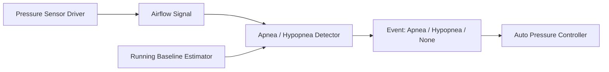
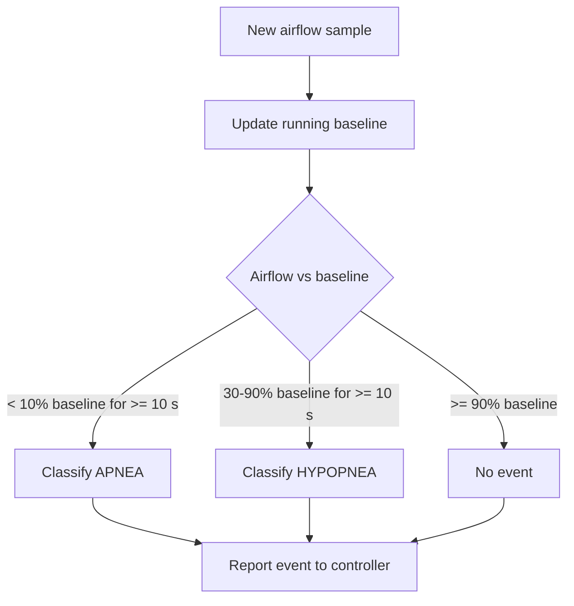

# Apnea / Hypopnea Detector

Classifies apnea and hypopnea events from the airflow signal against a running baseline.

Implemented in `therapy_control/apnea_detector.c`. See the module's unit tests under `tests/`.

## Architecture

## Classification flow

