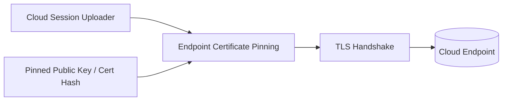
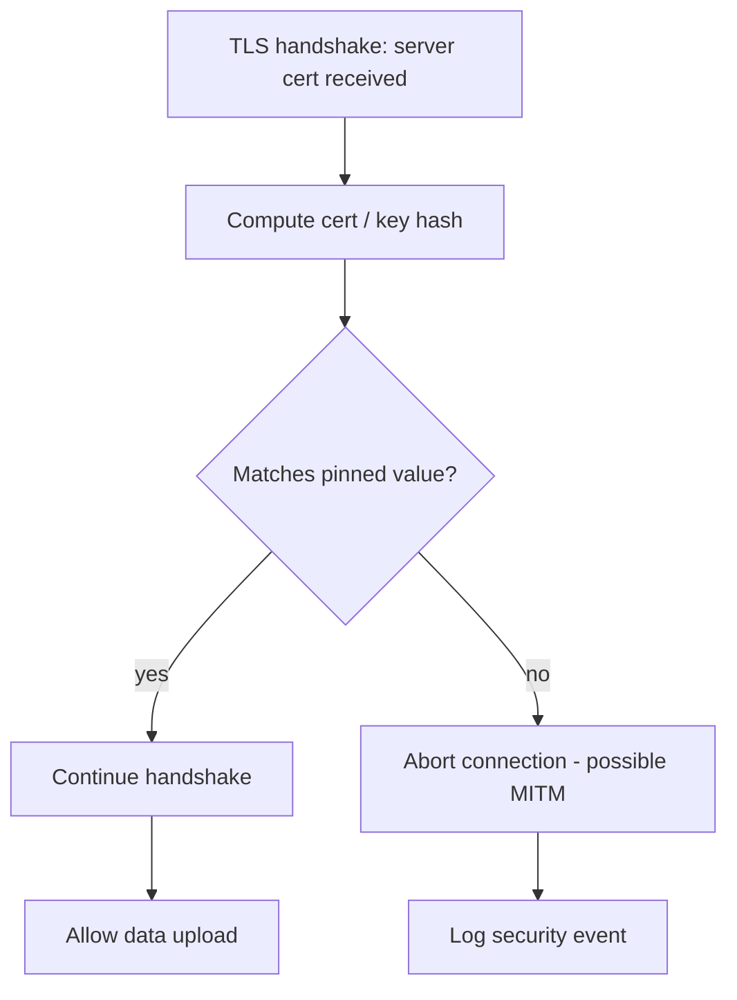

# Endpoint Certificate Pinning

Verifies the cloud endpoint via certificate pinning to block MITM.

Implemented in `connectivity/cert_pinning.c`. See the module's unit tests under `tests/`.

## Architecture

## Verification flow

