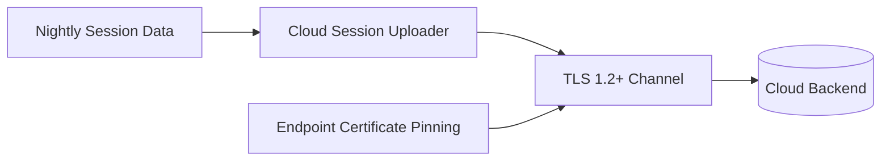
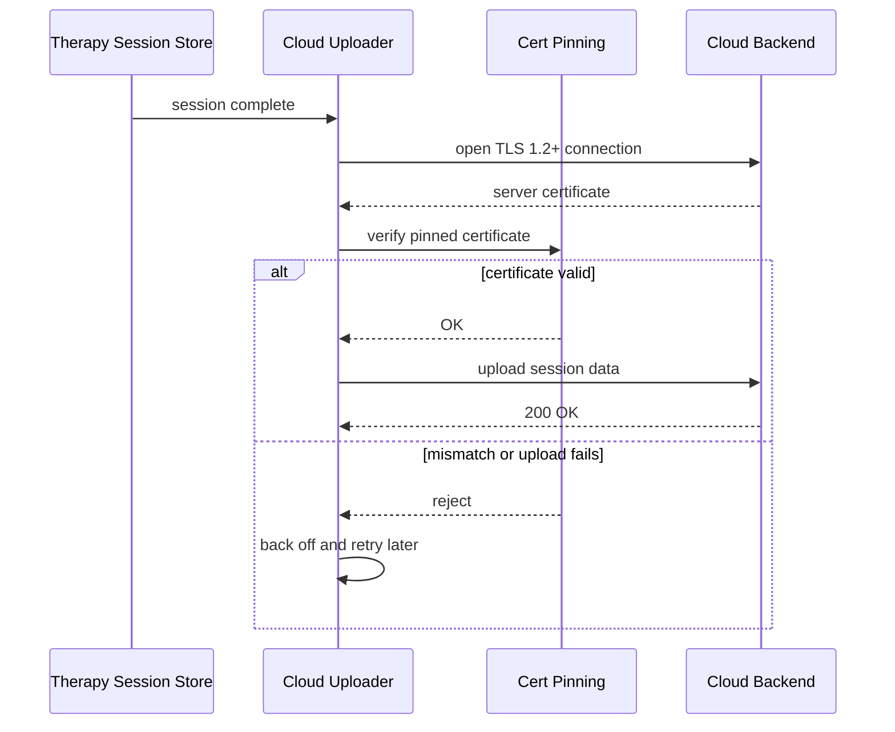

# Cloud Session Uploader

Uploads nightly session data to the cloud over TLS 1.2+.

Implemented in `connectivity/cloud_uploader.c`. See the module's unit tests under `tests/`.

## Architecture

## Upload sequence

