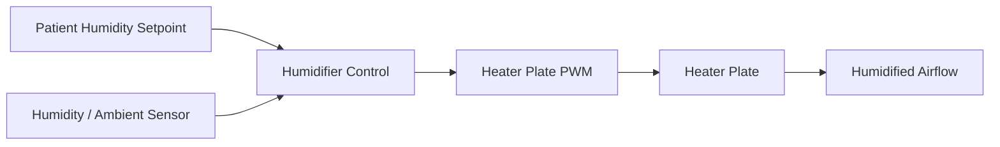
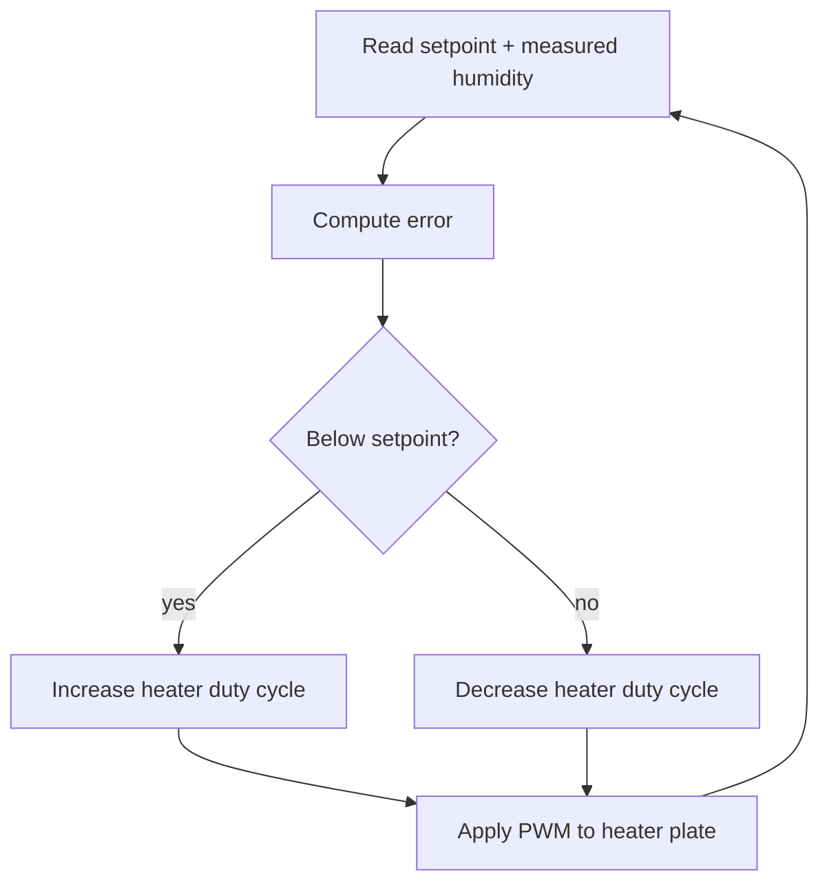

# Humidifier Control

Drives the heater plate to hold the patient-set humidity setpoint.

Implemented in `humidifier/humidity_control.c`. See the module's unit tests under `tests/`.

## Architecture

## Control loop

