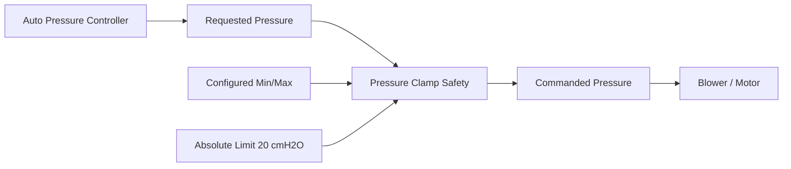
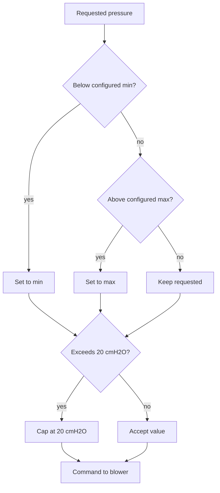

# Pressure Clamp (Safety)

Hard-limits commanded pressure to the configured range and never exceeds 20 cmH2O.

Implemented in `therapy_control/pressure_clamp.c`. See the module's unit tests under `tests/`.

## Architecture

## Clamp flow

