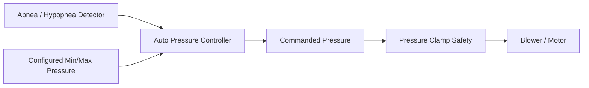
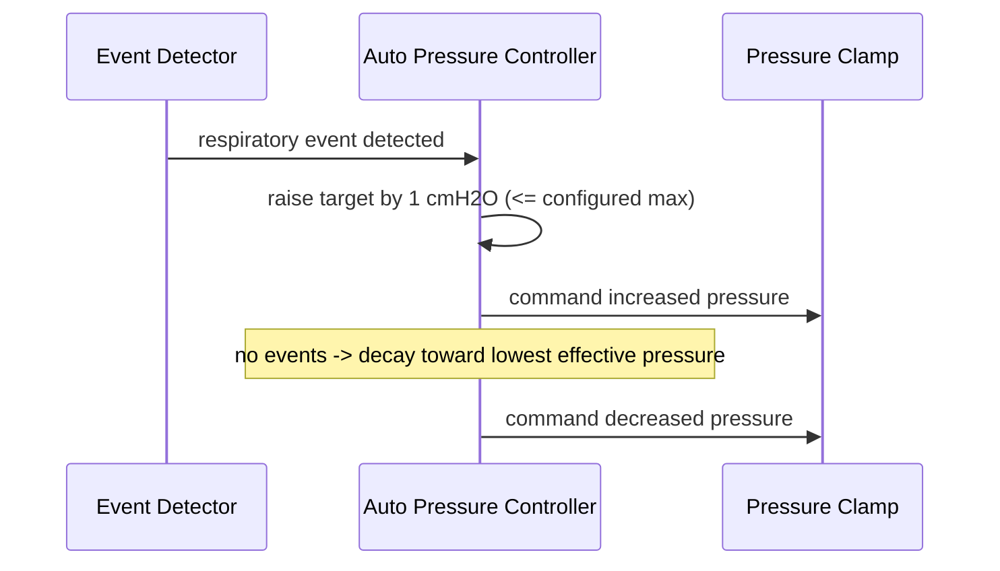

# Auto Pressure Controller

Raises delivered pressure in 1 cmH2O steps on detected events, seeking the lowest effective pressure.

Implemented in `therapy_control/pressure_controller.c`. See the module's unit tests under `tests/`.

## Architecture

## Titration sequence

