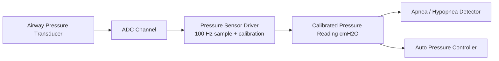
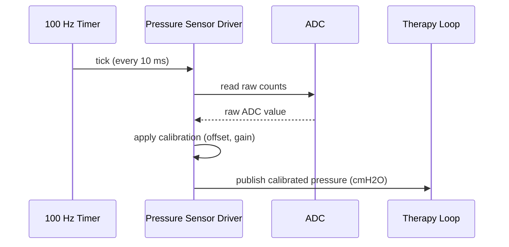

# Pressure Sensor Driver

Samples the airway pressure transducer at 100 Hz and exposes calibrated readings to the therapy loop.

Implemented in `therapy_control/pressure_sensor.c`. See the module's unit tests under `tests/`.

## Architecture

## Sampling sequence

