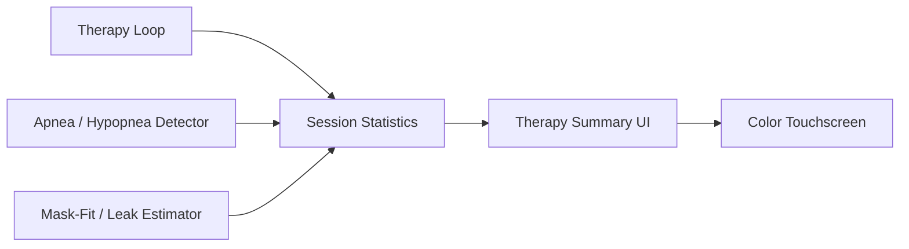
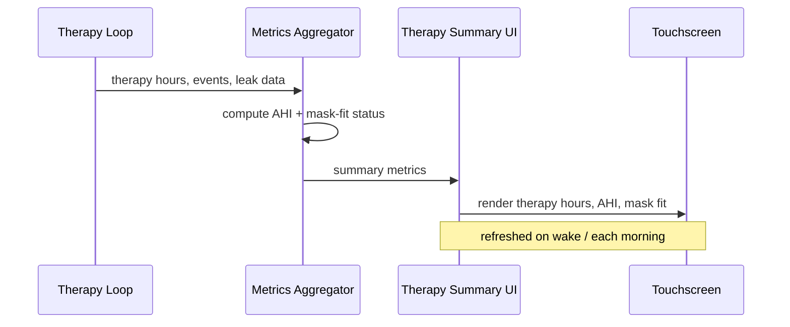

# Therapy Summary UI

Renders therapy hours, AHI, and mask-fit status on the color touchscreen.

Implemented in `ui/touchscreen_app.c`. See the module's unit tests under `tests/`.

## Architecture

## Render sequence

