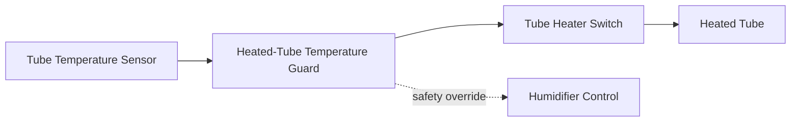
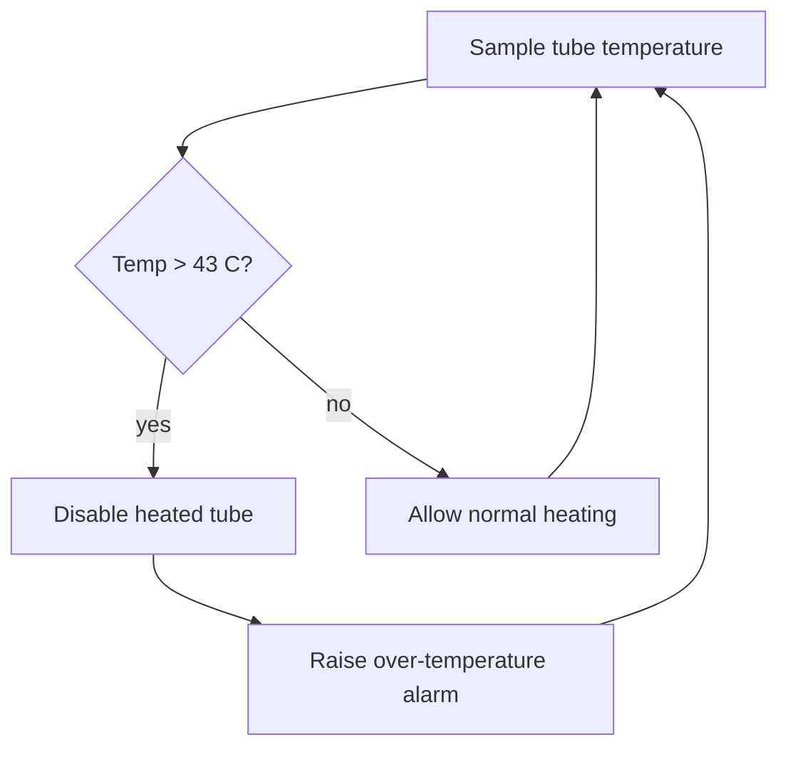

# Heated-Tube Temperature Guard

Disables the heated tube when measured tube temperature exceeds 43 C.

Implemented in `humidifier/tube_temp_guard.c`. See the module's unit tests under `tests/`.

## Architecture

## Over-temperature flow

